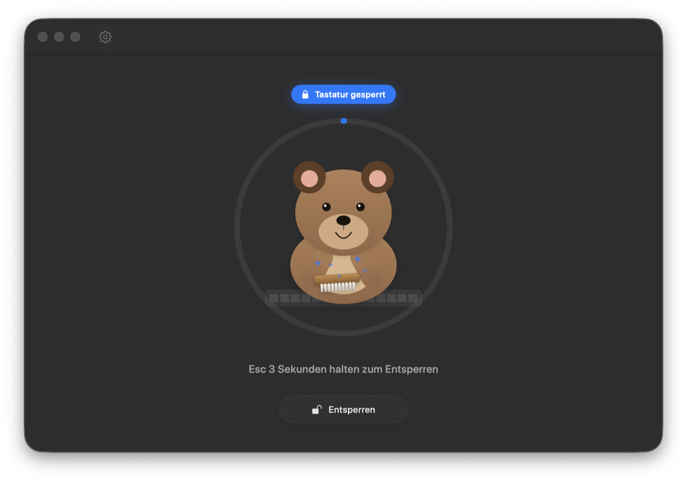
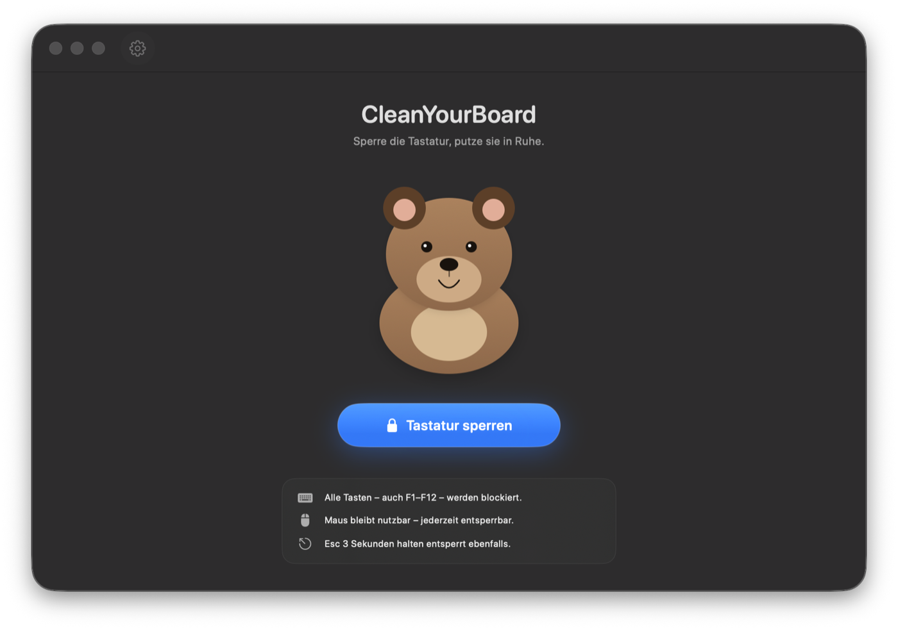
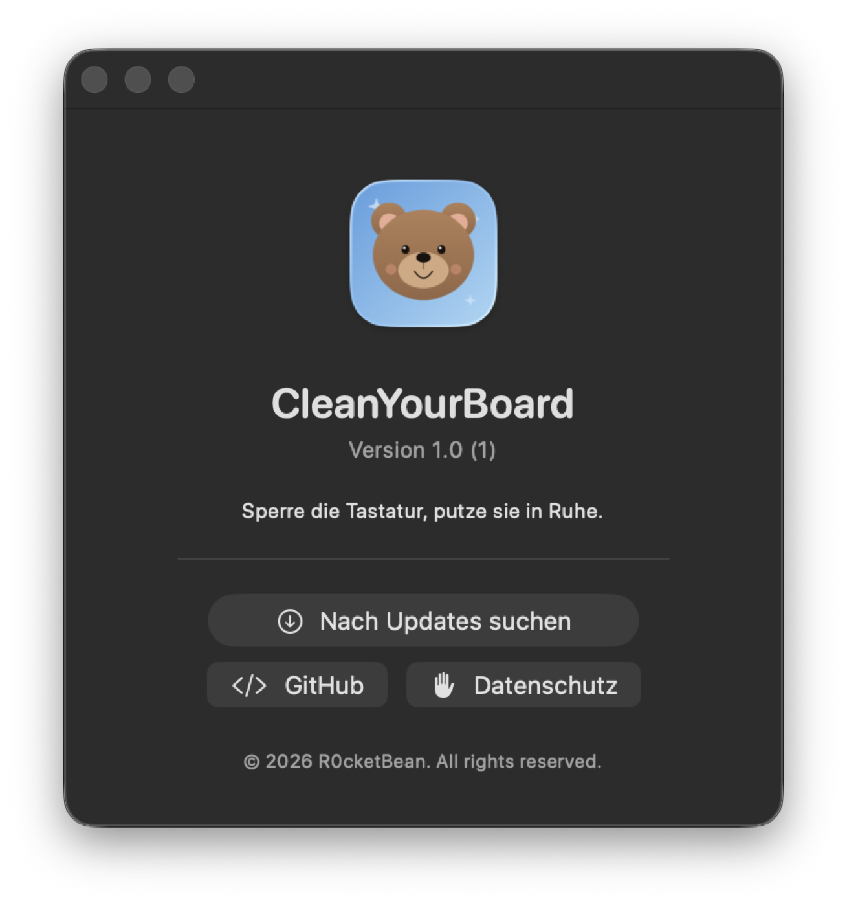
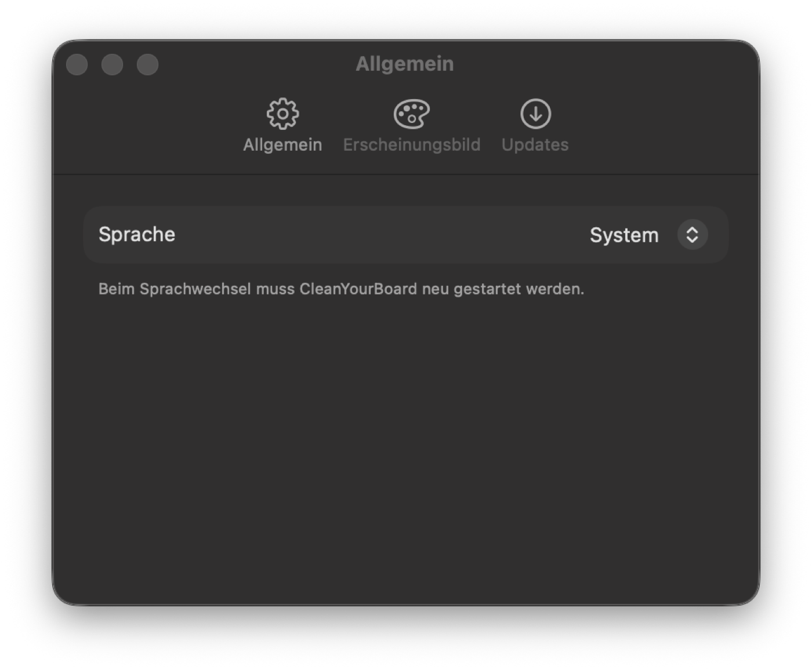

# CleanYourBoard

<p align="center">
  
</p>

<p align="center">
  <strong>Lock your Mac keyboard. Clean it in peace.</strong><br>
  A tiny macOS utility that blocks every key — including F1–F12 and media keys — while you wipe your keyboard down.
</p>

<p align="center">
  <a href="https://github.com/R0cketBean/CleanYourBoard/releases/latest"><strong>Download&nbsp;latest</strong></a> ·
  <a href="#features">Features</a> ·
  <a href="#screenshots">Screenshots</a> ·
  <a href="#how-to-unlock">Unlock</a> ·
  <a href="PRIVACY.md">Privacy</a>
</p>

<p align="center">
  
</p>

---

## Features

- 🔒 **Blocks every physical key**, including F1–F12 and the brightness, volume and media keys other lockers miss.
- 🐻 **Friendly bear animation** that scrubs while the lock is active — so you actually see something is happening.
- 🖱 **Mouse stays fully usable** — you're never locked out by accident.
- ⏱ **Two ways to unlock**: click the on-screen Unlock button, or hold `Esc` for three seconds.
- 💡 **Display stays awake** while the keyboard is locked, so the screen doesn't go dark mid-cleaning.
- 🪟 **Menubar quick action** — lock or unlock from the menubar without opening the window.
- 🌗 **Light / Dark / System** appearance, switchable in Settings.
- 🌍 **Seven languages**: English, Deutsch, Français, Español, Italiano, 日本語, 简体中文.
- 🔄 **Self-updates** via [Sparkle](https://sparkle-project.org).
- 🪶 Native SwiftUI app, ~1 MB, no background services or daemons.

## Screenshots

<table>
  <tr>
    <td align="center"><strong>Idle</strong></td>
    <td align="center"><strong>Locked</strong></td>
  </tr>
  <tr>
    <td></td>
    <td></td>
  </tr>
  <tr>
    <td align="center"><strong>About</strong></td>
    <td align="center"><strong>Settings</strong></td>
  </tr>
  <tr>
    <td></td>
    <td></td>
  </tr>
</table>

## Install

1. Download the latest `.dmg` from the [Releases page](https://github.com/R0cketBean/CleanYourBoard/releases/latest).
2. Open the DMG and drag **CleanYourBoard** into your `Applications` folder.
3. Launch it. On first start macOS will ask for **Accessibility** access — this is required so the app can intercept (and block) keyboard input globally.

> **Why Accessibility?** macOS requires this permission for any app that needs to read or block keyboard events across the system. CleanYourBoard never logs, transmits, or stores keystrokes. See [PRIVACY.md](PRIVACY.md).

## How to unlock

While the keyboard is locked you have two options:

- 🖱 Click the **Unlock** button in the app window
- ⌨️ Hold **`Esc`** for ~3 seconds (a progress ring fills around the bear)

## Requirements

- macOS 14 (Sonoma) or later
- Apple Silicon or Intel
- Accessibility permission (granted on first run)

## Building from source

```bash
git clone https://github.com/R0cketBean/CleanYourBoard.git
cd CleanYourBoard
open "CleanYourBoard - Keyboard Cleaner.xcodeproj"
```

Then build & run from Xcode. The project uses Swift Package Manager for [Sparkle](https://sparkle-project.org); Xcode will resolve it on first build.

## Privacy

Short version: **the app reads keystrokes only to block them. Nothing is recorded, written to disk, or sent anywhere.** No analytics. No telemetry. No network calls except Sparkle's update check.

Full statement: [PRIVACY.md](PRIVACY.md).

## License

MIT — see [LICENSE](LICENSE).

## Credits

Made by **[R0cketBean](https://github.com/R0cketBean)**. Bear, brush, sparkles and all UI assets drawn procedurally with SwiftUI — no bitmaps shipped.

Auto-update powered by [Sparkle](https://sparkle-project.org).
